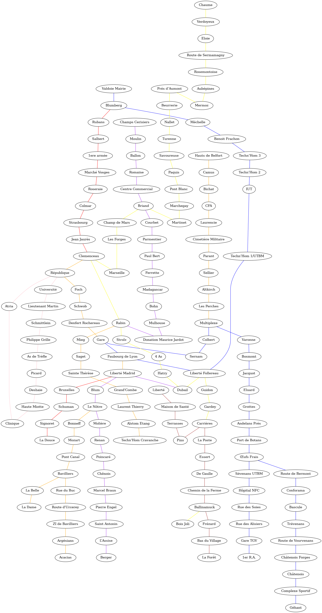

# projetGraphe
2 graphs projects using python

## Project maze
A maze that is created randomly and then solved by finding the shortest path between the top-left corner and the bottom-right corner using Dijkstra algorithm 
Requirements : python with modules random, networkx and pygame

## Project bice
A graph composed of graphs that represents the urban bice network of Belfort 
The programm permits to find the shortest path between 2 bice stops using Dijkstra algorithm, but it doesn't consider distances between bice stops, nor marching between to bice stops to shorten the distance, nor the time between the bice stops 
Requirements : python with modules graphviz, networkx, tkinter 
Image of the bice network (represented by graphviz, doesn't correspond to the real one)

January - February 2026 
Damien LUGBULL
